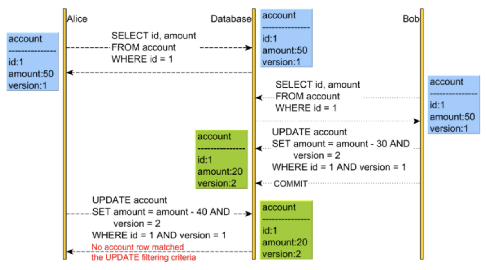

# Locking

## Optimistic Locking & Pessimistic Locking

When developing a web or mobile app, multiple processes may access the same data concurrently. To maintain data integrity from the concurrency issue, **optimistic locking** and **pessimistic locking** are primarily used.

    
Comparison 

|                                | **Optimistic Locking**                               | **Pessimistic Locking**                            |
| ------------------------------ | ---------------------------------------------------- | -------------------------------------------------- |
| **Assumption**                 | Conflicts are rare and can be handled at commit      | Conflicts are likely and should be prevented       |
| **Locking Mechanism**          | No locks during read; check for conflicts at write   | Locks acquired during read/write operations        |
| **Performance**                | Higher throughput in low-conflict scenarios          | Can degrade performance due to locking overhead    |
| **Use Cases**                  | Read-heavy, low contention environments              | High contention, critical data integrity           |
| **Complexity**                 | Requires conflict detection and resolution logic     | Simpler in environments where locking is necessary |
| **Scalability**                | Better scalability with many concurrent transactions | Less scalable due to locks limiting concurrency    |
| **Risk of Retries**            | High in conflict-heavy environments                  | Low, as conflicts are prevented by locks           |
| **Deadlock Potential**         | Minimal, since locks are not held during processing  | High, especially with multiple locks               |
| **Resource Utilization**       | Efficient, as locks are not held unnecessarily       | Inefficient if locks are held for long durations   |
| **Examples of Implementation** | Version numbers, timestamps, compare-and-swap        | Database row/table locks, mutexes, semaphores      |

## Optimistic Lock

Optimistic Locking is a strategy that assumes no conflicts will occur when updating data.

- Prevents conflicts by adding a version column.
- When a conflict does occur, it is handled at the **application** layer rather than by the database.

## Pessimistic Lock

Pessimistic locking is a strategy that prevent access to data by acquiring a Shared Lock or an Exclusive Lock before updating data.

- Shared Lock (Read Lock): A shared lock, also known as a read lock, is used when a transaction performs read operations. Since it only involves reading data, multiple shared locks can access the data simultaneously, but write operations are blocked.

- Exclusive Lock (Write Lock): An exclusive lock, also known as a write lock, is used when a transaction modifies data. It is held until the transaction is completed and blocks both read and write operations until the exclusive lock is released.

## Tags

`lock`

## Reference

- https://f-lab.kr/insight/understanding-optimistic-and-pessimistic-locking
